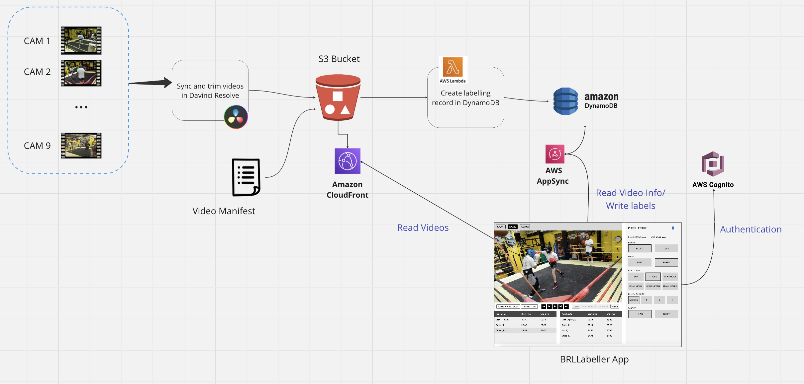

# BRL Labeller

An AWS Amplify React application to label boxing videos. 

Features include:
1. Support for multiple camera views
2. Ability to select an area of video to zoom
3. Captures labels for hand, punch type, punch quality and target

The architecture is laid out in the following diagram.



Multi-cam footage is uploaded to an S3 bucket that is fronted by AWS CloudFront. Details 
about the video are recorded in a DynamoDB table `VideoDataSource`. The React application
authenticates using Cognito, reads the available data sources from DynamoDB, via and AppSync GraphQL API
and displays the video in the player. Labels captured by the user are uploaded to another DynamoDB
table (`LabelSession`) via AppSync.

## Development environment installation
> [!NOTE]
> If this is the first time you are creating a development environment for an Amplify project
> check out the [Setup Instructions](docs/SETUP.md).

Clone this repository and create a new feature branch:

```{bash}
git clone git@github.com:boxraw-tech/BRLLabeller.git
cd BRLLabeller
git checkout -b newfeature
npm install
```

Now you can setup your amplify environment. In general you should use the `test` environment:

```amplify pull --app-id de9m7ezx4j86i --branch test```

Finally you can start a local server for your React by running `npm run dev`.

Once the changes are ready for general review you can update the hosted environment by running `amplify publish`.
